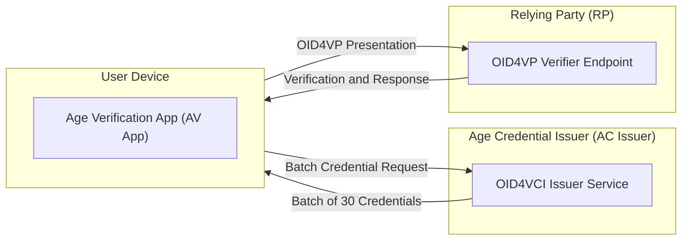
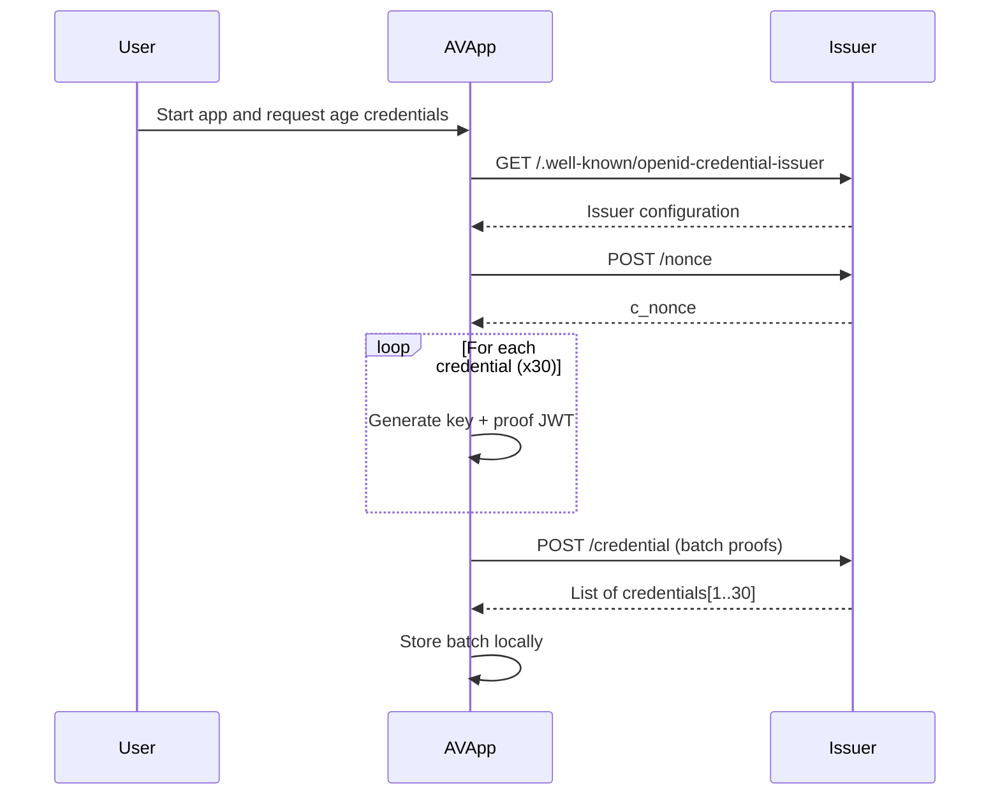
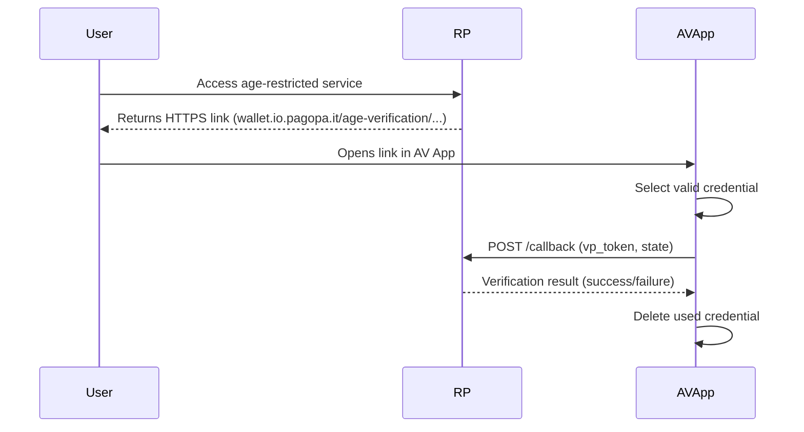

# Draft Architectural Document — Age Verification POC

> ⚠️ **Draft document** — This document describes the Proof of Concept (POC) architecture for the Age Verification solution based on *OpenID for Verifiable Credentials (OID4VCI)* and *OpenID for Verifiable Presentations (OID4VP)*.
> It also references the [European Technical Specification](https://github.com/eu-digital-identity-wallet/av-doc-technical-specification) for age verification.
> It does not represent a production-ready implementation but an experimental design intended to validate the interoperability, usability, and trust model of digital age verification.

---

## 1. Objective

This document outlines the logical architecture, key flows, and technical considerations of the **Age Verification Proof of Concept (POC)**.

The purpose of this POC is to demonstrate a digital **Age Verification flow** through a dedicated app (“AV App”) that allows users to:

- Obtain a **batch of digital age credentials** issued by the **Age Credential Issuer**.
- Present a proof of age to a **Relying Party (RP)** in a secure and privacy-preserving manner.
- Manage the **lifecycle of credentials**, including renewal and local storage.

The solution leverages **OpenID for Verifiable Credential Issuance (OID4VCI)** and **OpenID for Verifiable Presentations (OID4VP)** standards to ensure interoperability with the emerging **European Digital Identity (EUDI)** ecosystem.

---

## 2. Logical Architecture

### 2.1 Overview of Components

| Component | Description | Notes |
|------------|--------------|-------|
| **Age Verification App (AV App)** | Mobile app that manages credential issuance, storage, and presentation. | Generates key pairs locally and securely stores credentials. |
| **Age Credential Issuer (AC Issuer)** | The credential issuer responsible for generating and signing age credentials. | Hosted at [https://avissuer-ipzs.westeurope.cloudapp.azure.com](https://avissuer-ipzs.westeurope.cloudapp.azure.com). For this POC, no user authentication is required. |
| **Relying Party (RP)** | The service that requires proof of age to grant access to restricted content. | Example: [https://verifier.ageverification.dev/](https://verifier.ageverification.dev/) |
| **User** | The person using the app to verify their age. | Interacts through consent and simple user actions (e.g., scan QR). |

---



---

## 3. Functional Flow

### 3.1 Batch Issuance — Age Credential Issuance Flow

When the app is launched for the first time, it must obtain a **batch of 30 age credentials**.
This batch will later be used to perform multiple verifications without requiring new issuance each time.

This simplified flow follows **OID4VCI**, without any user authentication step.

#### Main Steps

1. **Issuer Discovery**
   The AV App retrieves the issuer metadata from:

   ```
   GET /.well-known/openid-credential-issuer
   ```

   It discovers endpoints and supported credential configurations (e.g., `eu.europa.ec.eudi.age_verification_mdoc`).

2. **Nonce Request**
   The app requests a cryptographic nonce from the issuer by calling:

   ```
   POST /nonce
   ```

   The issuer returns a `c_nonce` used to bind proofs (JWT) to a specific issuance session.

3. **Proof Generation (JWT Proofs)**
   The app generates 30 unique key pairs (one per credential) and signs a set of 30 **proof JWTs**, each using its respective private key.

    **Non normative example of proof**
    ```json
    {
        "alg": "ES256",
        "jwk": {
            "alg": "ES256",
            "crv": "P-256",
            "kid": "A18C991A-84F8-4B78-BF02-C3E952FF59E6",
            "kty": "EC",
            "use": "sig",
            "x": "bU9T6nIlncPUhSYXycHVlr8d2dDrrukOmwbhUAUXhCE",
            "y": "GrldxjgpJhhSZRuSkJW9pFXdHOCYoQtkzfvv8Mbc5s4"
            },
        "typ": "openid4vci-proof+jwt"
    }
    .
    {
        "aud": "https://avissuer-ipzs.westeurope.cloudapp.azure.com",
        "iat": 1751357401,
        "iss": "wallet-dev",
        "nonce": "eyJ0eXBlIjoiY25vbmNlK2p3dCIsImFsZyI6IlJTQS1PQUVQIiwiZW5jIjoiQTI1NkdDTSJ9.scDQd_n5HoITlyeFDtTIKYPhrd3y0MW8ItetdWqYbCpHrORY5_s7VDMIZvcAeFs93pF98BgVTmaUPJmescQDqLS_wGevHRvM-YUo8hTt2bmmIrADpm8Kv2djRbsMb6GrE8YBfLhX4CFN0rQQrKsUbJGQcwASt_CcjZT4wu_18MoUCDaFs27D2rdS9myA46EKHoBPC7dKRlnVveAR2tHn_vjfUcElk3EdPhMyg1l-cjRKKOga2jgEL8VpI9sGuneryYYw0YQ68GmsTZJ_FmsBhu8NGweUQr-1TljuFIvb7DxotfOUwFL4JDFzrTOBPIB04xxErQYGvdcI1Zb_J6SevQ.TegNsJRxb4zcjaLN.VhBPIpa_WxT1CW_I9RXHtdfLs0StnOuN4hD7t7ozUXJKgmKuFiEc5oCFN_qlBIwDS8UjmNkS1zwcdvH8mZAK3qLwgrTUFnBvRIKCnto3OsOD69jZpN6f1JvOLf2GUuqLUycH11lRBwBClCQDtFQPfRAFbOez5SOc6we3fwXxo9VaPgP7W_6qON3QyEMQ3Rs2qaWZtrSwGv53JJKwAOAt2F1hjanP6fcIDGOF_wa0IVMuQRKdkuoIumR3XqxDbUdCRxiQ0CwZV5iYeioWkdYcMk487-axXHOi.BdNlBjPu2xjjxiBewrLh4A"
    }
    ```


4. **Batch Request to the Issuer**
   The app sends all JWT proofs in a single `POST /credential` request to the issuer.

   **Example Request:**

   ```json
   {
     "proofs": {
       "jwt": [
         "eyJhbGciOiJFUzI1NiIsInR5cCI6IkpXVCJ9...",
         "eyJhbGciOiJFUzI1NiIsInR5cCI6IkpXVCJ9..."
       ]
     },
     "format": "mso_mdoc",
     "doctype": "eu.europa.ec.av.1",
     "credential_configuration_id": "eu.europa.ec.eudi.age_verification_mdoc"
   }
   ```

   **Example Response:**

   ```json
   {
     "credentials": [
       { "credential": "..." },
       { "credential": "..." }
     ],
     "notification_id": "Jev5X3ozcBhh0L00N96Gyw"
   }
   ```

5. **Local Storage**
   The 30 credentials are securely stored locally in the device's secure storage (e.g., Keychain, Secure Enclave, Android Keystore).
   Each credential includes metadata such as issuance date, expiration date (3 months), and associated key material.

---

### 3.2 Sequence Diagram — Batch Issuance



---

### 3.3 Presentation Flow — Age Proof (OID4VP)

When a user accesses an age-restricted service, the RP requests a **Verifiable Presentation (VP)**.

The flow can be initiated either via QR code or through a **universal HTTPS link**, such as:

```
https://wallet.io.pagopa.it/age-verification/?client_id=https://verifier.ageverification.dev/&response_type=vp_token&presentation_definition_uri=https://verifier.ageverification.dev/presentation-definition.json&redirect_uri=https://verifier.ageverification.dev/callback&state=xyz123
```

#### Main Steps

1. **Request Reception**
   The AV App intercepts the link or QR code, parses the `presentation_definition`, and determines which credential type is required.

2. **Credential Selection**
   The AV App selects one valid credential from the local batch (not expired, not used).

3. **Verifiable Presentation Creation**
   The app generates a **VP** that includes only the necessary attributes (e.g., “Age ≥ 18”), signs it with the credential’s private key, and attaches proof of possession.

4. **Submission to RP**
   The presentation is submitted to the RP via `POST` to the specified `redirect_uri`, along with the `state` parameter for correlation.

5. **Credential Deletion**
   Once successfully presented, the credential is deleted from the local store to prevent reuse.

---

### 3.4 Sequence Diagram — Presentation via Universal Link



---

## 4. Data Model

The age credential data format is derived from the ISO 18013-5 standard and is in CBOR format.

### 4.1 Credential Structure

#### 4.1.1 Issuer Authentication (`issuerAuth`)
This field contains the cryptographic proof of authenticity from the issuing authority. Typically, it is represented as a CBOR array consisting of:

- **Protected header**: Specifies algorithm and key information (e.g., COSE header).
- **Digital certificate chain**: X.509 certificates or equivalent, including root and intermediate certificates.
- **COSE signature**: Generated by the issuer to validate the integrity of the credential data.

This ensures the credential is tamper-evident and cryptographically verifiable by relying parties.

#### 4.1.2 Namespaces (`nameSpaces`)
Credentials are organized into **namespaces**, each representing a domain-specific set of attributes. For example, `eu.europa.ec.av.1` might contain driving license-related data. Each namespace contains:

- **Credential elements**, each represented as a CBOR object with:
  - `elementIdentifier`: Unique string identifying the attribute (e.g., `"age_over_18"`).
  - `elementValue`: The actual value of the attribute (boolean).
  - `digestID`: Integer linking the attribute to a digest in the issuer authentication data.
  - `random`: Nonce or random value used in digest computation to prevent replay attacks.

#### 4.1.3 Validity Fields
Each credential carries metadata for lifecycle management:

- `validFrom`: Start of the credential validity.
- `validUntil`: Expiration timestamp.


#### 4.1.4 Device and Signature Binding (`deviceKeyInfo`, `signer`)
The credential may include cryptographic references to device keys used for secure storage or presentation. These fields ensure that the credential cannot be cloned or used on unauthorized devices.

#### 4.1.5 Encoding
The entire credential is encoded in **CBOR** (Concise Binary Object Representation) and secured using **COSE (CBOR Object Signing and Encryption)** standards.

### 4.2 Attribute Set

The attribute set for Proof of Age attestations consists of:

| Attribute Identifier | Definition | Presence in Issuance | Presence in verification | Encoding format |
| :---- | :---- | :---- | :---- | :---- |
| age_over_18 | This attribute is present in all Proof of Age attestations and indicates whether the user is above 18. | Mandatory | Conditional mandatory (either age_over_18 or one of age_over_NN attributes SHALL be requested) | bool |
| portrait | A reproduction of the Proof of Age attestation user's portrait. It will be used only for future proximity flows | Optional | Not allowed in remote presentation flows Optional in proximity flows | bstr  |
| age_over_NN | Confirming whether the Proof of Age attestation user is currently over NN years of age. Multiple entries MAY be provided as separate attributes. Supported values of NN: 13, 15, 16, 21, 23, 25, 27, 28, 40, 60, 65, 67. Age statements for other values of NN are not supported by this schema. | Optional | Conditional mandatory (either age_over_18 or one of age_over_NN attributes SHALL be requested)  | bool |

### 4.3 Non normative example

```
{
  "issuerAuth": [
    h'a10126',
    {
      33: h'308202bd30820263a00302010202144e4b041c8c22ba2c7ae96a64cd2475b27162fb2a300a06082a8648ce3d04030230693126302406035504030c1d41676520566572696669636174696f6e2049737375657220434120303131323030060355040a0c2941676520566572696669636174696f6e205265666572656e636520496d706c656d656e746174696f6e310b3009060355040613024156301e170d3235303430383233343034365a170d3236303730323233343034355a30653122302006035504030c1941676520566572696669636174696f6e204453202d2030303131323030060355040a0c2941676520566572696669636174696f6e205265666572656e636520496d706c656d656e746174696f6e310b30090603550406130241563059301306072a8648ce3d020106082a8648ce3d03010703420004bae260a91cf520652293db654c0f19f5cc7fae9388f73d025b3252d035b6bcb96c799414fb510ef79c609284b379d1b85eb812240ccbc525318db72016ebdb00a381ec3081e9301f0603551d23041830168014b13258c9ed461b5b1dce3855e09f6fe89c90b0ba30160603551d250101ff040c300a06082b8102020000010230440603551d1f043d303b3039a037a035863368747470733a2f2f6973737565722e616765766572696669636174696f6e2e6465762f706b692f41565f43415f30312e63726c301d0603551d0e0416041420dedf57fb318b998a762e464494b021ce76d310300e0603551d0f0101ff04040302078030390603551d12043230300603551d1204293027822568747470733a2f2f636f6d6d697373696f6e2e6575726f70612e65752f696e6465785f656e300a06082a8648ce3d040302034800304502200860f6aaeaa39fe479ec697e1eadbb0b473cb0e75c7b9e489edd20bb5dd1afbf022100a90a05b2fa2eaab6a523fc6be44f92ee7c21725a741d13629021fad6ad14d3ac'
    },
    h'd818590153a667646f63547970657165752e6575726f70612e65632e61762e316776657273696f6e63312e306c76616c6964697479496e666fa3667369676e6564c074323032352d30372d30315430383a31303a30325a6976616c696446726f6dc074323032352d30372d30315430383a31303a30325a6a76616c6964556e74696cc074323032352d30392d32395430303a30303a30305a6c76616c756544696765737473a17165752e6575726f70612e65632e61762e31a10058207b2db923a7efdf718290b5932127089a6cf30ffa6939d5a4cbd7d23d657313b06d6465766963654b6579496e666fa1696465766963654b6579a40102200121582090c28273ea893a79ee1b493736113fe4fb40a43a75b1327755d91c6dd4dd835f2258201b23eef6da970157edde53d993350e1e9c005f7b9a757a735df4ce7ab94c35636f646967657374416c676f726974686d675348412d323536',
    h'40d60b8db483ccc598977e71b27926151275260c4721c39bbf88f5ee8f3f2693028053443a47b42f82cf5e9baac575c91e9d86b72951f0e48c20bceb01f052e3'
  ],
  "nameSpaces": {
    "eu.europa.ec.av.1": [
      24(<<
        {
          "random": h'3051650d248163231b614c9972f857e2cd100578c11cf599069307b1ad8bfc15',
          "digestID": 0,
          "elementValue": true,
          "elementIdentifier": "age_over_18"
        }
      >>)
    ]
  }
}

```

## 5. Security Analysis

### 5.1 Identified Risk

The **batch issuance** approach allows the generation of multiple credentials without ensuring that their corresponding private keys are generated within a **secure hardware environment**.
This poses a risk of **key extraction** and **credential misuse**.

#### Potential Impacts

- A malicious actor could extract private keys and distribute valid credentials publicly (e.g., Telegram, GitHub).
- Since the credentials are anonymous and long-lived (3 months), they could be reused indefinitely.
- The Age Credential Issuer cannot distinguish between legitimate and rogue apps.

### 5.2 Mitigation Strategies

- **Key Attestation:** Enforce attestation proving that keys are generated within trusted hardware (Secure Enclave, StrongBox).
- **Device Integrity Verification:** Combine attestation with device integrity APIs (Play Integrity, SafetyNet, DeviceCheck).
- **Short-lived Credentials:** Issue time-bound credentials (ideally one-time-use or valid for less than 24h).
- **On-demand Issuance:** Replace batch issuance with per-request issuance to reduce attack surface.

## 6. Data Protection Analysis 
### 6.1 Compliance with Resolution No. 96/25/CONS and GDPR Requirements

This subsection analyzes the technical, legal, and organizational requirements for full compliance with Resolution No. 96/25/CONS and related Garante opinions, including considerations for its potential use within the APP IO and/or the IT-Wallet System.
The Age Verification solution—whether integrated into the **APP IO** environment or deployed via the core **IT-Wallet System**—is compliant with all technical, legal, and organizational mandates, specifically adhering to the core privacy principles established by the **GDPR (Art. 5(1))** and the **eIDAS 2.0** framework. Crucially, the system meets the high standards established by the **AGCOM Resolution No. 96/25/CONS**, which requires verifying the age of users with a system that ensures a **"level of security adequate to the risk and the respect of the minimization of personal data collected for the purpose"**.

**Technically and Organizationally,** the solution is built upon the **European Digital Identity (EUDI) Wallet Architecture and Reference Framework (ARF)**, leveraging foundational technical standards for **interoperability, security, and privacy**.

The core technical safeguard is **Selective Disclosure (SD)**, which allows the User to present only a cryptographically verified **Boolean attribute** (e.g., *Over 18: True*). This device-based proof model ensures that the Verifier never accesses the raw Date of Birth, thereby guaranteeing **data minimization**.

Furthermore, to prevent tracking or profiling, the IT-Wallet's organizational structure, defined by applicable legislation, enforces: 1) **logical separation** of personal data from other services provided by the Wallet Provider (PagoPA) and 2) the **non-storage of sensitive content** by the Issuer (IPZS), which retains only the **HASH** of the Attestation for revocation purposes, which is non-personal data.
**Legally**, the system operates based on a clear dual foundation: the issuance of the Attestation by public entities (IPZS and PagoPA, legally mandated) relies on a **Public Interest Task (Art. 6(1)(e) GDPR)**, while the actual **use and presentation** of the age proof is strictly conditional upon the **explicit and informed consent of the User**. This robust framework confirms our solution as **effective, suitable, proportional, and functional**, aligning with the "highly recommended" modalities promoted by AGCOM and satisfying the requirements set forth by the Garante for a privacy-preserving Age Assurance solution.

### 6.2 Conclusion on Age Verification Risk

The decentralised architecture and the mandatory use of Selective Disclosure techniques ensure that the risks of central surveillance, tracking, and data aggregation are minimised. By reducing the shared attribute from the raw Date of Birth to a **minimal, purpose-specific Boolean proof**, the IT-Wallet's Age Verification component adheres to the highest standard of **Data Protection by Design**, successfully balancing security, usability, and data privacy. The residual risk to the rights and freedoms of the Data Subject is deemed **low and manageable** through the defined technical and organisational controls.

---

## 7. References

- [OID4VCI Specification](https://openid.net/specs/openid-4-verifiable-credential-issuance-1_0.html)
- [OID4VP Specification](https://openid.net/specs/openid-4-verifiable-presentations-1_0.html)
- [EUDI Age Verification Solution Technical Specification](https://github.com/eu-digital-identity-wallet/av-doc-technical-specification)
- [Age Verification Issuer Example (IPZS)](https://avissuer-ipzs.westeurope.cloudapp.azure.com/.well-known/openid-credential-issuer)
- [Verifier Example RP](https://verifier.ageverification.dev/)

---
